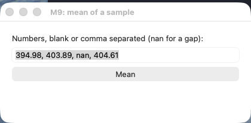
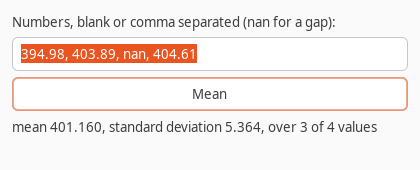
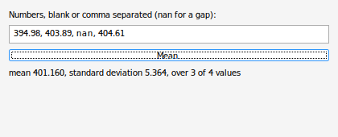

# A native desktop window in M9

One M9 program that opens a real window on macOS, Windows and Linux,
drawn by each platform's own widgets: Cocoa on macOS, Win32 on Windows,
GTK 3 on Linux. Type numbers, press **Mean**, and the window shows the
mean and the standard deviation and how many values they used. A gap
(`nan`) is skipped and counted, and a sample with nothing in it gets a
sentence instead of a number, as in chapter 6 of the tutorial.

| macOS (Cocoa) | Linux (GTK 3) | Windows (Win32) |
|---|---|---|
|  |  |  |

The macOS picture is the window as it opens; the Linux and Windows
ones are after a press of Mean. (The Linux one has no title bar: it
was taken on a virtual display with no window manager.)

## How it is put together

| File | What it is |
|---|---|
| `GuiMean.m9` | The program, 150 lines of safe M9 with its comments: no `UNSAFE`, no `ADR`. The C functions it calls are declared at the end of the file, each `[SERIAL]`. |
| `gui.c` | The whole foreign boundary, under 180 lines of C over [libui-ng](https://github.com/libui-ng/libui-ng), the library that wraps each platform's native widgets. |
| `build.sh` | Builds `guimean` on macOS and Linux. |
| `build-windows.sh` | Builds `guimean.exe` from Linux with MinGW. |

Three choices keep the M9 side checkable:

- **A widget is a number.** `gui.c` keeps the libui-ng objects in a
  table; M9 sees only the index. No pointer crosses the boundary.
- **Text crosses one byte at a time**, as UTF-8: `Put` appends a byte
  that the next widget call uses, and `GetText` and `Byte` read a
  widget's text back.
- **A click is an event the program asks for.** `Next` runs the
  platform's event loop until a button is pressed or the window is
  closed, and answers which. Nothing in C calls back into M9, so the
  program reads as a plain loop:

```
  LOOP
    ev := I64 (Next ()) ;
    IF ev = Closed THEN EXIT END ;
    IF ev = mean THEN SetLabel (result, Summary (TextOf (pool, input))) END
  END
```

A larger program would grow `gui.c` the same way: one function per
widget kind or property it needs, each taking and answering ints.

## Building it

All three need M9 0.15 or later and, the first time, git, meson and
ninja (`pip install meson ninja`) to fetch and build libui-ng. The
scripts fetch it at a pinned commit into `libui-ng/` and build it
once, as a static library.

**macOS** needs Apple's Command Line Tools (libui-ng's Cocoa half is
Objective-C, built by Apple's clang) and M9 from the Homebrew tap:

    sh build.sh && ./guimean

**Linux** needs the GTK 3 headers (`libgtk-3-dev` on Debian and
Ubuntu, `gtk3-devel` on Fedora):

    sh build.sh && ./guimean

On a machine whose desktop session runs Wayland, GTK uses it; to put
the window on an X display instead (a virtual one, say), run it with
`GDK_BACKEND=x11`.

**Windows**: build from Linux with MinGW (`gcc-mingw-w64-x86-64-win32`
and `g++-mingw-w64-x86-64-win32` on Debian and Ubuntu), then copy
`guimean.exe` to Windows. It imports only DLLs that Windows itself
ships, so nothing goes beside it:

    sh build-windows.sh

The script asks `m9c` to write the program and the library modules it
uses as C. That C never names a platform, so MinGW compiles it for
Windows, together with M9's runtime sources and Windows' common
controls manifest, which a static libui-ng cannot carry itself.

## What was checked

- **macOS 26, Apple silicon**: built with M9 0.15.0 from Homebrew. The
  window opens and draws with AppKit; the 405 KB program links only
  system frameworks.
- **Linux, Ubuntu 26.04, x86-64**: built with the M9 0.15.0 package
  against GTK 3.24. On a virtual X display the window opens, Mean is
  pressed from the keyboard (Tab, Space), and the result line reads
  `mean 401.160, standard deviation 5.364, over 3 of 4 values`, which
  is the mean and sample standard deviation of 394.98, 403.89 and
  404.61.
- **Windows**: built on Linux with MinGW; run under wine 10 on the same
  virtual display, Mean clicked with the mouse: the same line. It has
  not yet been run on a real Windows machine.

libui-ng is MIT-licensed (its `LICENSE.md`), which allows linking it
into this GPL program.
